## Практическое задание №3

Выполнил: Веселый Д. А.

Группа: пми-32

Вариант: 7

### **Цель**:

Сформировать практические навыки аппроксимации табличных функций с помощью сглаживающих сплайнов.

### **Формулировка задания.**

1. Разработать класс, реализующий интерфейс сглаживающего сплайна. На каждом сегменте разбиения
использовать базисную систему финитных функций
первого порядка. Сглаживающий сплайн g ( x) строить как решение задачи о минимизации функционала в линейном подпространстве $$\Phi=(1-p)||f(x)-g(x)||^2_2+p||g'(x)||^2_2,$$ где p - параметр сглаживания.
2. В качестве входных данных сгенерируйте по нормальному закону последовательность случайных чисел (число наблюдений и параметры распределения взять из таблицы).
3. На одной диаграмме изобразить интерполяционный
и сглаживающий сплайны: ось абсцисс – номер случайного числа, ось ординат – сгенерированные случайные числа. Параметр сглаживания p варьировать
от 0 до 1. Выяснить, на что влияет варьирование весовых коэффициентов в дискретном скалярном произведении при построении сглаживающего сплайна.
4. Проанализируйте поведение графика сглаживающего сплайна при p = 0. Какими свойствами он обладает?
5. Решите предложенную задачу средствами языка Python. Какими недостатками обладает данный инструмент анализа данных? Как их обойти?

### Исходные данные

|№ варианта|N - число наблюдений|M - мат. ожидание|$\sigma$ - отклонение|
|---|---|---|---|
|7|1670|1.04|3.74|

### Решение
Сглаживающий сплайн g ( x) строить как решение задачи о минимизации функционала в линейном подпространстве $$\Phi=(1-p)w||f(x)-g(x)||^2_2+p||g'(x)||^2_2,$$ где p - параметр сглаживания, w - веса каждой точки (по умолчанию 1).
Так как сплайн 1 порядка, то на каждом сегменте: $g'(x) = \frac{f_{i+1} - f_i}{h_i}$, с учетом $h_i = 1$ $||g'(x)||^2_2 = \sum_i(f_{i+1} - f_i)^2$. Чтобы найти минимум, нужно взять частные производные по каждой неизвестной $f_k$ и приравнять их к нулю: ∂J / ∂$f_k$ = 0. Тогда для внутреннего узла: $$-p * f_{k-1} + ((1 - p)*w_k + 2p) * f_k - p * f_{k+1} = (1 - p) *w_k* y_k$$, или в виде СЛАУ это трехдиагональная матрица A, где главная диагональ (1-p) и побочные -p. Получаем A * f = y. Такая СЛАУ решается методом прогонки из первой лабораторной работы. f - и есть значение точек сглаживающего сплайна.
## Графики сплайнов

### Графики построены на основе .csv файлов, сгенерированных моей C++ программой в соответствии с вариантом

```python
import pandas as pd
import matplotlib.pyplot as plt
import seaborn as sns
```

### Рассмотрим сплайн аппроксимацию выборки из 1670 элементов нормального распреления при M = 1.04, $\sigma$ = 3.74 и различным параметром сглаживания


```python
df = pd.read_csv("../../spline_p0.csv", sep=",")
print(df.info())
plt.figure(figsize=(16, 9))
plt.plot(df['x'], df['f(x)'], linestyle='--', linewidth=2, alpha=0.8)
plt.scatter(df['x'], df['f(x)'], marker='.', color='red', s=40)
plt.xlabel('x')
plt.ylabel('f(x)')
plt.grid(True, alpha=0.5)
plt.ylim((-3.74,3.74))
plt.title('Сглаживание p = 0', fontsize=16)
plt.show()
```

    <class 'pandas.core.frame.DataFrame'>
    RangeIndex: 1670 entries, 0 to 1669
    Data columns (total 2 columns):
     #   Column  Non-Null Count  Dtype  
    ---  ------  --------------  -----  
     0   x       1670 non-null   int64  
     1   f(x)    1670 non-null   float64
    dtypes: float64(1), int64(1)
    memory usage: 26.2 KB
    None


    
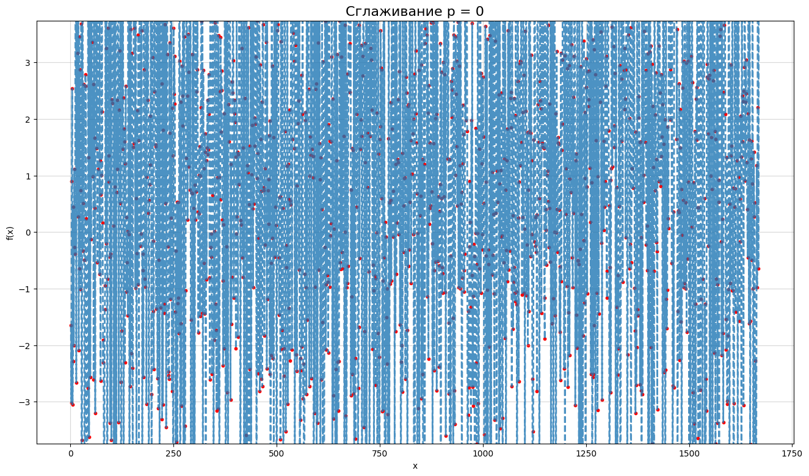
    


```python
df = pd.read_csv("../../spline_p01.csv", sep=",")
print(df.info())
plt.figure(figsize=(16, 9))
plt.plot(df['x'], df['f(x)'], linestyle='--', linewidth=2, alpha=0.8)
plt.scatter(df['x'], df['f(x)'], marker='.', color='red', s=40)
plt.xlabel('x')
plt.ylabel('f(x)')
plt.grid(True, alpha=0.5)
plt.ylim((-3.74,3.74))
plt.title('Сглаживание p = 0.1', fontsize=16)
plt.show()
```

    <class 'pandas.core.frame.DataFrame'>
    RangeIndex: 1670 entries, 0 to 1669
    Data columns (total 2 columns):
     #   Column  Non-Null Count  Dtype  
    ---  ------  --------------  -----  
     0   x       1670 non-null   int64  
     1   f(x)    1670 non-null   float64
    dtypes: float64(1), int64(1)
    memory usage: 26.2 KB
    None


    
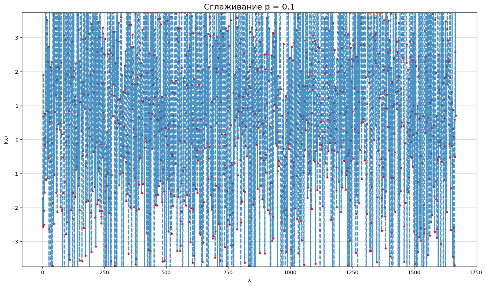
    


```python
df = pd.read_csv("../../spline_p03.csv", sep=",")
print(df.info())
plt.figure(figsize=(16, 9))
plt.plot(df['x'], df['f(x)'], linestyle='--', linewidth=2, alpha=0.8)
plt.scatter(df['x'], df['f(x)'], marker='.', color='red', s=40)
plt.xlabel('x')
plt.ylabel('f(x)')
plt.grid(True, alpha=0.5)
plt.ylim((-3.74,3.74))
plt.title('Сглаживание p = 0.3', fontsize=16)
plt.show()
```

    <class 'pandas.core.frame.DataFrame'>
    RangeIndex: 1670 entries, 0 to 1669
    Data columns (total 2 columns):
     #   Column  Non-Null Count  Dtype  
    ---  ------  --------------  -----  
     0   x       1670 non-null   int64  
     1   f(x)    1670 non-null   float64
    dtypes: float64(1), int64(1)
    memory usage: 26.2 KB
    None


    
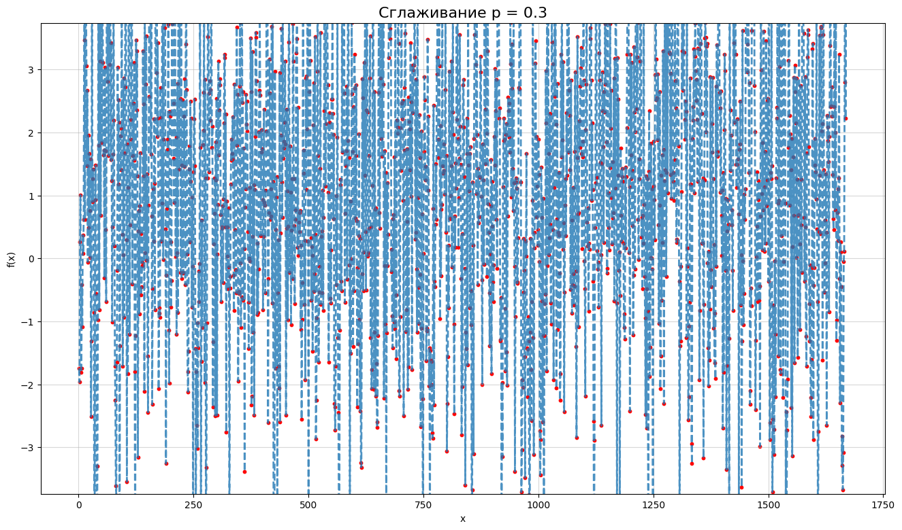
    


```python
df = pd.read_csv("../../spline_p05.csv", sep=",")
print(df.info())
plt.figure(figsize=(16, 9))
plt.plot(df['x'], df['f(x)'], linestyle='--', linewidth=2, alpha=0.8)
plt.scatter(df['x'], df['f(x)'], marker='.', color='red', s=40)
plt.xlabel('x')
plt.ylabel('f(x)')
plt.grid(True, alpha=0.5)
plt.ylim((-3.74,3.74))
plt.title('Сглаживание p = 0.5', fontsize=16)
plt.show()
```

    <class 'pandas.core.frame.DataFrame'>
    RangeIndex: 1670 entries, 0 to 1669
    Data columns (total 2 columns):
     #   Column  Non-Null Count  Dtype  
    ---  ------  --------------  -----  
     0   x       1670 non-null   int64  
     1   f(x)    1670 non-null   float64
    dtypes: float64(1), int64(1)
    memory usage: 26.2 KB
    None


    
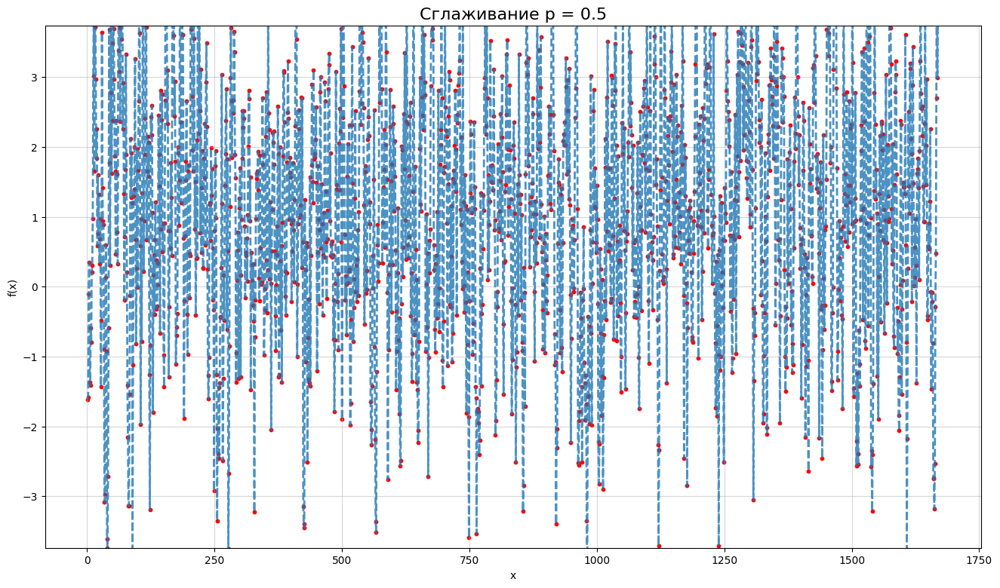
    


```python
df = pd.read_csv("../../spline_p07.csv", sep=",")
print(df.info())
plt.figure(figsize=(16, 9))
plt.plot(df['x'], df['f(x)'], linestyle='--', linewidth=2, alpha=0.8)
plt.scatter(df['x'], df['f(x)'], marker='.', color='red', s=40)
plt.xlabel('x')
plt.ylabel('f(x)')
plt.grid(True, alpha=0.5)
plt.ylim((-3.74,3.74))
plt.title('Сглаживание p = 0.7', fontsize=16)
plt.show()
```

    <class 'pandas.core.frame.DataFrame'>
    RangeIndex: 1670 entries, 0 to 1669
    Data columns (total 2 columns):
     #   Column  Non-Null Count  Dtype  
    ---  ------  --------------  -----  
     0   x       1670 non-null   int64  
     1   f(x)    1670 non-null   float64
    dtypes: float64(1), int64(1)
    memory usage: 26.2 KB
    None


    
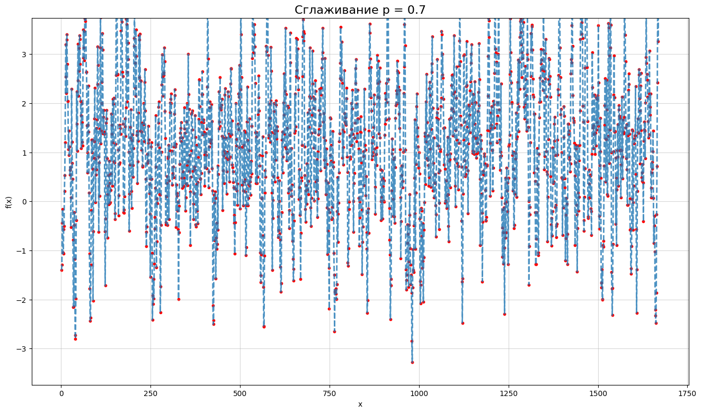
    


```python
df = pd.read_csv("../../spline_p09.csv", sep=",")
print(df.info())
plt.figure(figsize=(16, 9))
plt.plot(df['x'], df['f(x)'], linestyle='--', linewidth=2, alpha=0.8)
plt.scatter(df['x'], df['f(x)'], marker='.', color='red', s=40)
plt.xlabel('x')
plt.ylabel('f(x)')
plt.grid(True, alpha=0.5)
plt.ylim((-3.74,3.74))
plt.title('Сглаживание p = 0.9', fontsize=16)
plt.show()
```

    <class 'pandas.core.frame.DataFrame'>
    RangeIndex: 1670 entries, 0 to 1669
    Data columns (total 2 columns):
     #   Column  Non-Null Count  Dtype  
    ---  ------  --------------  -----  
     0   x       1670 non-null   int64  
     1   f(x)    1670 non-null   float64
    dtypes: float64(1), int64(1)
    memory usage: 26.2 KB
    None


    
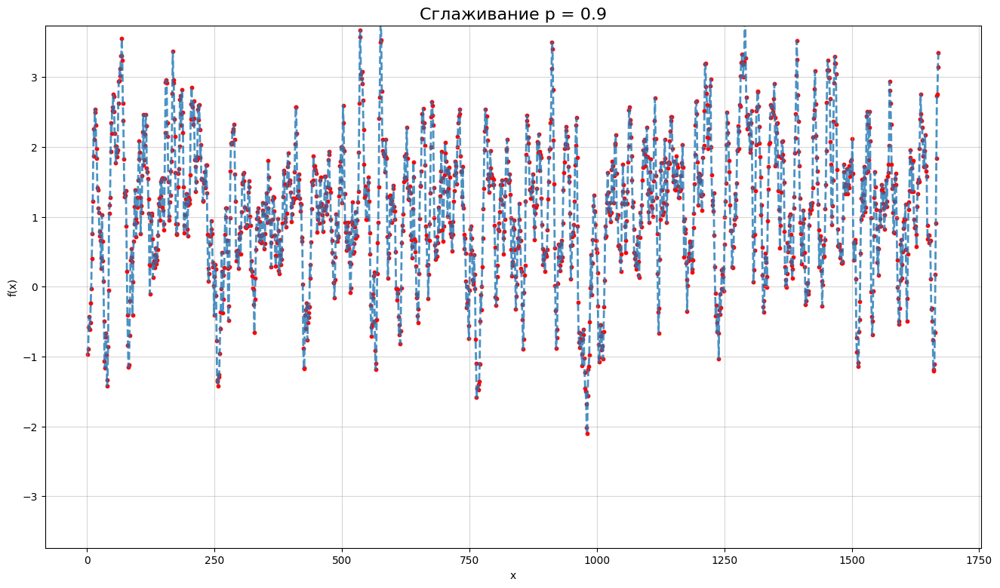
    


```python
df = pd.read_csv("../../spline_p099.csv", sep=",")
print(df.info())
plt.figure(figsize=(16, 9))
plt.plot(df['x'], df['f(x)'], linestyle='--', linewidth=2, alpha=0.8)
plt.scatter(df['x'], df['f(x)'], marker='.', color='red', s=40)
plt.xlabel('x')
plt.ylabel('f(x)')
plt.grid(True, alpha=0.5)
plt.ylim((-3.74,3.74))
plt.title('Сглаживание p = 0.99', fontsize=16)
plt.show()
```

    <class 'pandas.core.frame.DataFrame'>
    RangeIndex: 1670 entries, 0 to 1669
    Data columns (total 2 columns):
     #   Column  Non-Null Count  Dtype  
    ---  ------  --------------  -----  
     0   x       1670 non-null   int64  
     1   f(x)    1670 non-null   float64
    dtypes: float64(1), int64(1)
    memory usage: 26.2 KB
    None


    
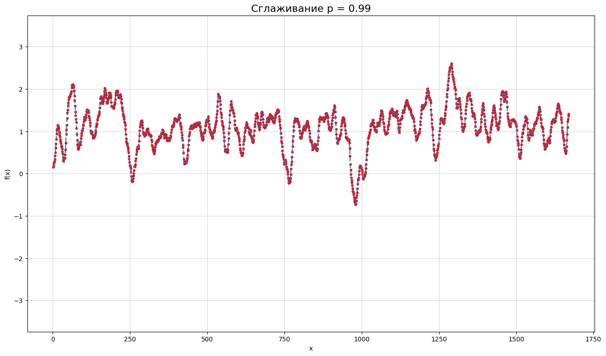
    


```python
df = pd.read_csv("../../spline_p1.csv", sep=",")
print(df.info())
plt.figure(figsize=(16, 9))
plt.plot(df['x'], df['f(x)'], linestyle='--', linewidth=2, alpha=0.8)
plt.scatter(df['x'], df['f(x)'], marker='.', color='red', s=40)
plt.xlabel('x')
plt.ylabel('f(x)')
plt.grid(True, alpha=0.5)
plt.ylim((-3.74,3.74))
plt.title('Сглаживание p ~ 1', fontsize=16)
plt.show()
```

    <class 'pandas.core.frame.DataFrame'>
    RangeIndex: 1670 entries, 0 to 1669
    Data columns (total 2 columns):
     #   Column  Non-Null Count  Dtype  
    ---  ------  --------------  -----  
     0   x       1670 non-null   int64  
     1   f(x)    1670 non-null   float64
    dtypes: float64(1), int64(1)
    memory usage: 26.2 KB
    None


    
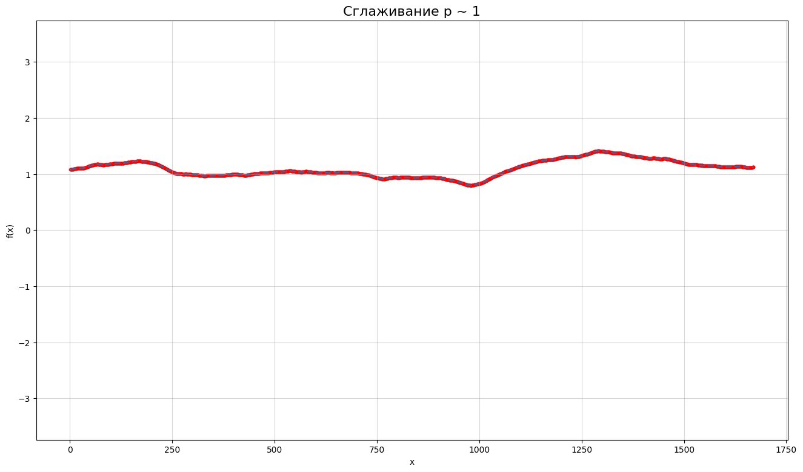
    


### Так как на большой выборке тяжело разглядеть разницу в конкретных значениях сетки, рассмотрим небольшую выборку из 10 элементов того же распределения с сглаживанием от 0 до 1 и попробуем варьировать веса


```python
df = pd.read_csv("../../splines1.csv", sep=",")
print(df.info())
plt.figure(figsize=(16, 9))
plt.plot(df['x'], df['f(x)0'], marker='o', linestyle='--', color='red', label='p=0', linewidth=2, alpha=0.8)
plt.plot(df['x'], df['f(x)0.3'], marker='o', linestyle='--', color='orange', label='p=0.3', linewidth=2, alpha=0.8)
plt.plot(df['x'], df['f(x)0.5'], marker='o', linestyle='--', color='green', label='p=0.5', linewidth=2, alpha=0.8)
plt.plot(df['x'], df['f(x)0.7'], marker='o', linestyle='--', color='blue', label='p=0.7', linewidth=2, alpha=0.8)
plt.plot(df['x'], df['f(x)1'], marker='o', linestyle='--', color='purple', label='p=1', linewidth=2, alpha=0.8)
plt.xlabel('x')
plt.ylabel('f(x)')
plt.grid(True, alpha=0.5)
plt.ylim((-3.74,3.74))
plt.title('Сглаживание p = [0, 0.3, 0.5, 0.7, 1],', fontsize=16)
plt.show()
```

    <class 'pandas.core.frame.DataFrame'>
    RangeIndex: 10 entries, 0 to 9
    Data columns (total 6 columns):
     #   Column   Non-Null Count  Dtype  
    ---  ------   --------------  -----  
     0   x        10 non-null     int64  
     1   f(x)0    10 non-null     float64
     2   f(x)0.3  10 non-null     float64
     3   f(x)0.5  10 non-null     float64
     4   f(x)0.7  10 non-null     float64
     5   f(x)1    10 non-null     float64
    dtypes: float64(5), int64(1)
    memory usage: 612.0 bytes
    None


    
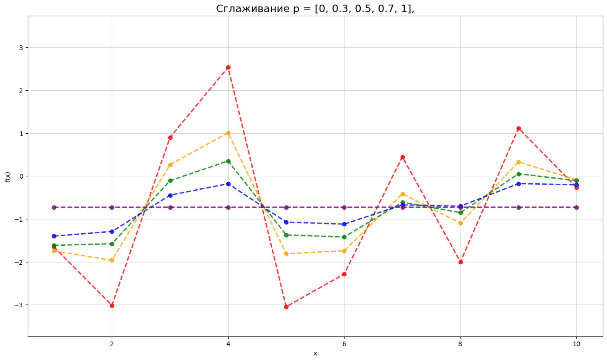
    


### Как видим, небольшая выборка дала большую ошибку, так как прямая при p~1 далеко от M = 1.04. Попробуем подогнать данные увеличив вес четвертой точки с 1 до 10


```python
df = pd.read_csv("../../splines2.csv", sep=",")
print(df.info())
plt.figure(figsize=(16, 9))
plt.plot(df['x'], df['f(x)0'], marker='o', linestyle='--', color='red', label='p=0', linewidth=2, alpha=0.8)
plt.plot(df['x'], df['f(x)0.3'], marker='o', linestyle='--', color='orange', label='p=0.3', linewidth=2, alpha=0.8)
plt.plot(df['x'], df['f(x)0.5'], marker='o', linestyle='--', color='green', label='p=0.5', linewidth=2, alpha=0.8)
plt.plot(df['x'], df['f(x)0.7'], marker='o', linestyle='--', color='blue', label='p=0.7', linewidth=2, alpha=0.8)
plt.plot(df['x'], df['f(x)1'], marker='o', linestyle='--', color='purple', label='p=1', linewidth=2, alpha=0.8)
plt.xlabel('x')
plt.ylabel('f(x)')
plt.grid(True, alpha=0.5)
plt.ylim((-3.74,3.74))
plt.title('Сглаживание p = [0, 0.3, 0.5, 0.7, 1], w[3] = 10', fontsize=16)
plt.show()
```

    <class 'pandas.core.frame.DataFrame'>
    RangeIndex: 10 entries, 0 to 9
    Data columns (total 6 columns):
     #   Column   Non-Null Count  Dtype  
    ---  ------   --------------  -----  
     0   x        10 non-null     int64  
     1   f(x)0    10 non-null     float64
     2   f(x)0.3  10 non-null     float64
     3   f(x)0.5  10 non-null     float64
     4   f(x)0.7  10 non-null     float64
     5   f(x)1    10 non-null     float64
    dtypes: float64(5), int64(1)
    memory usage: 612.0 bytes
    None


    
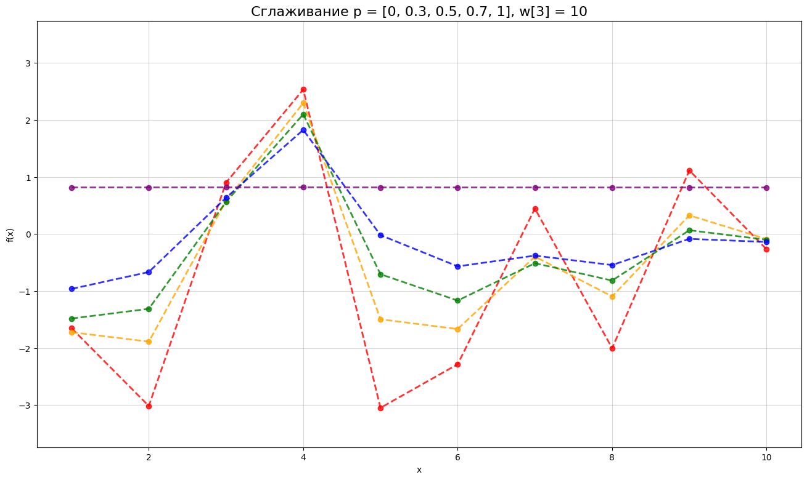

## Анализ графиков

При сглаживании p = 0 график является интерполяционным сплайном первого порядка, при увеличении параметра сглаживания график становится более "гладким", значения точек все ближе как среднему значению (мат. ожиданию). При p~1 график напоминает прямую f(x) = M. Весовые коэффициенты позваляют варьировать вклад каждой точки и также могут выступать фильтром, чтобы убрать выбросы в данных.

## Решение на Python

```python
import numpy as np
import matplotlib.pyplot as plt
from scipy.interpolate import UnivariateSpline

N = 1670 
M = 1.04      
SIGMA = 3.74  

# генератор случайных чисел
rng = np.random.default_rng(seed=7)

x = np.arange(N)
y = rng.normal(loc=M, scale=SIGMA, size=N)


# 2. Построение сглаживающих сплайнов
# Ключевой параметр в UnivariateSpline - это 's', коэффициент сглаживания.
# Он аналог (1-p)/p
# - s = 0: Сплайн будет интерполяционным (пройдет через все точки).
# - s > 0: Сплайн будет сглаживающим. Чем больше s, тем сильнее сглаживание.
# Если s=None (по умолчанию), SciPy пытается подобрать оптимальное значение автоматически.

# Попробуем три разных степени сглаживания
s_low = N * 0.1  # Слабое сглаживание
s_medium = N * 2 # Среднее сглаживание
s_high = N * 10  # Сильное сглаживание

spline_low = UnivariateSpline(x, y, s=s_low)
spline_medium = UnivariateSpline(x, y, s=s_medium)
spline_high = UnivariateSpline(x, y, s=s_high)

x_smooth = np.linspace(0, N - 1, N * 5)

# Вычисляем значения сплайнов на новой сетке
y_smooth_low = spline_low(x_smooth)
y_smooth_medium = spline_medium(x_smooth)
y_smooth_high = spline_high(x_smooth)

# 3. Визуализация результатов
plt.figure(figsize=(15, 8))

plt.scatter(x, y, s=10, alpha=0.5,marker='o', label='Исходные данные (нормальное распределение)', color='black')
plt.plot(x_smooth, y_smooth_low, label=f'Слабое сглаживание (s={s_low:.0f})', color='green', linewidth=2)
plt.plot(x_smooth, y_smooth_medium, label=f'Среднее сглаживание (s={s_medium:.0f})', color='blue', linewidth=2.5)
plt.plot(x_smooth, y_smooth_high, label=f'Сильное сглаживание (s={s_high:.0f})', color='red', linewidth=2)
plt.axhline(y=M, color='orange', linestyle='--', linewidth=2, label=f'Истинное среднее M={M}')
plt.title('Сглаживающий сплайн на Python с помощью UnivariateSpline', fontsize=16)
plt.xlabel('x', fontsize=12)
plt.ylabel('f(x)', fontsize=12)
plt.legend(fontsize=10)
plt.grid(True)
plt.show()
```


    
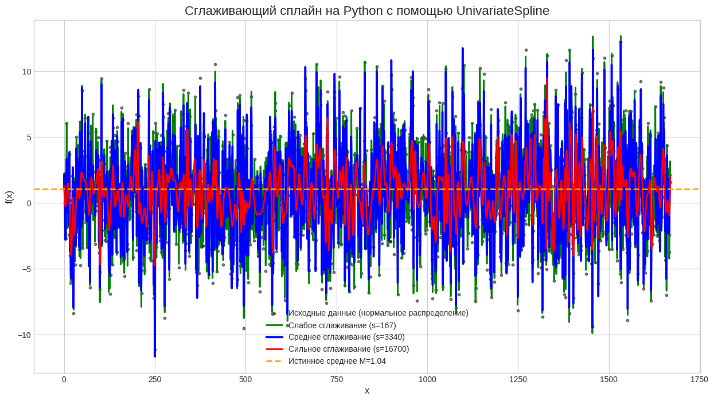

### Недостатки
- Непонятная величина s вместо $p\in[0,1)$
- Отсутствие возможности выбора весовых коэффициентов

## Вывод
Я сформировал практические навыки аппроксимации табличных функций с помощью сглаживающих сплайнов и проверил как вариация параметра сглаживания и весовых коэффициентов влияет на вид графика сплайнов. 

## Приложение (программный код на C++):
### Вспомогательный класс полинома ploynom.hpp
```cpp
#pragma once

#include <cmath>
#include <iostream>
#include <vector>

using ld = long double;
using namespace std;

class Polynom {
 public:
  // Коэффициенты многочлена
  // степень - размер массива
  // пропуски заполняем нулями
  std::vector<ld> coeffs;

  Polynom() {}
  Polynom(const vector<ld> coeffs) : coeffs(coeffs) {}
  Polynom(ld num) : coeffs({num}) {}
  Polynom(const Polynom& other) : coeffs(other.coeffs) {}
  Polynom(Polynom&& other) noexcept : coeffs(move(other.coeffs)) {}
  Polynom& operator=(const Polynom& other) {
    if (this != &other) coeffs = other.coeffs;
    return *this;
  }
  Polynom& operator=(Polynom&& other) noexcept {
    if (this != &other) coeffs = move(other.coeffs);
    return *this;
  }

  /**
   * @brief Вычисление значения многочлена (функции)*/
  ld operator()(ld x) const noexcept {
    ld result = 0;
    for (int i = 0; i < coeffs.size(); ++i) result += coeffs[i] * pow(x, i);
    return result;
  }

  ld operator[](int idx) const { return coeffs[idx]; }
  ld& operator[](int idx) { return coeffs[idx]; }

  Polynom operator+(const Polynom& other) const noexcept {
    return Polynom(*this) += other;
  }

  Polynom operator-(const Polynom& other) const noexcept {
    if (degree() > other.degree()) {
      Polynom result(*this);
      for (int i = 0; i < other.degree(); ++i) result[i] -= other[i];
      return result;
    } else {
      Polynom result(other);
      for (int i = 0; i < degree(); ++i) result[i] -= coeffs[i];
      return result;
    }
  }

  Polynom operator-() const noexcept { return Polynom(*this) *= -1; }

  Polynom operator*(ld num) const noexcept { return Polynom(*this) *= num; }

  Polynom operator/(ld num) const { return Polynom(*this) /= num; }

  Polynom& operator+=(const Polynom& other) {
    if (other.degree() > degree()) coeffs.resize(other.degree(), 0.0);
    for (int i = 0; i < other.degree(); ++i) {
      coeffs[i] += other[i];
    }
    return *this;
  }

  Polynom& operator-=(const Polynom& other) {
    if (other.degree() > degree()) coeffs.resize(other.degree());
    for (int i = 0; i < other.degree(); ++i) coeffs[i] -= other[i];
    return *this;
  }

  Polynom& operator*=(ld num) noexcept {
    for (ld& x : coeffs) x *= num;
    return *this;
  }

  Polynom operator/=(ld num) {
    if (num == 0) throw invalid_argument("division by zero");
    for (ld& x : coeffs) x /= num;
    return *this;
  }

  /**
   * @brief Вывод многочлена
   */
  void print() const {
    ld right = degree() - 1;
    ld left = 0;
    if (right > 0 && coeffs[right] < 0) cout << '-';
    for (; right > left + 1; --right) {
      if (coeffs[right] != 0) {
        if (coeffs[right] != 1) cout << abs(coeffs[right]);
        cout << "x^" << right;
        cout << ((coeffs[right - 1] >= 0) ? " + " : " - ");
      }
    }
    if (right == 1) {
      if (coeffs[right] != 0) {
        if (coeffs[right] != 1) cout << abs(coeffs[right]);
        cout << "x";
        cout << ((coeffs[right - 1] >= 0) ? " + " : " - ");
      }
      --right;
    }
    if (right == 0) cout << abs(coeffs[0]);
    cout << endl;
  }

  // степень полинома (длина вектора)
  int degree() const noexcept { return coeffs.size(); }

  Polynom der() const noexcept {
    if (degree() > 1) {
      Polynom result(degree() - 1);
      for (int i = 1; i < degree(); ++i) result[i - 1] = coeffs[i] * i;
      return result;
    } else
      return Polynom(0);
  }
};

Polynom operator+(ld num, const Polynom& other) { return other + num; }
Polynom operator-(ld num, const Polynom& other) { return -other + num; }
Polynom operator*(ld num, const Polynom& other) { return other * num; }
```
### Класс генерации сплайнов spline.hpp
```cpp
#pragma once

#include <vector>
// класс многочлена
#include "polynom.hpp"

using ld = long double;
using namespace std;

class SmoothingSpline {
 public:
  ld p;
  vector<ld> initSample;  // табличная функция
  vector<Polynom> splines;
  vector<ld> f;  // значения точек сплайна на сетке

  /**
   * Формируем сплайны 1 порядка для табличной функции,
   * считая что x - индекс, f(x) - init[x]
   * сохраняем сплайны в splines
   */
  SmoothingSpline(ld p, const vector<ld>& init, const vector<ld>& weights)
      : p(p), initSample(init), splines(initSample.size() - 1), f(init) {
    auto n = initSample.size();
    vector<ld> m_diag(n, 0);
    vector<ld> alpha(n, 0);
    vector<Polynom> phi_1(n - 1), phi_2(n - 1);
    for (int i = 0; i < n - 1; ++i) {
      ld x_k = i + 1;
      Polynom xi({-x_k, 1});
      xi = xi * 2 - 1;  // h_k = 1 всегда
      phi_1[i] = (1 - xi) / 2, phi_2[i] = (1 + xi) / 2;
      alpha[i] = (1 - p) * initSample[i] * weights[i];
      m_diag[i] = (1 - p) * weights[i] + 2 * p;
    }
    m_diag[0] -= p;
    m_diag[n - 1] = (1 - p) * weights[n - 1] + p;
    alpha[n - 1] = (1 - p) * initSample[n - 1] * weights[n - 1];
    // Метод прогонки (u_diag = d_diag = -p)
    for (int i = 1; i < n; ++i) {
      ld m = -p / m_diag[i - 1];
      m_diag[i] -= p * p / m_diag[i - 1];
      alpha[i] += p * alpha[i - 1] / m_diag[i - 1];
    }
    f[n - 1] = alpha[n - 1] / m_diag[n - 1];
    for (int i = n - 2; i >= 0; --i)
      f[i] = (alpha[i] + p * f[i + 1]) / m_diag[i];
    // сплайны 1 порядка по точкам f
    for (int i = 0; i < n - 1; ++i) {
      ld x_k = i + 1;
      Polynom xi({-x_k, 1});
      xi = xi * 2 - 1;  // h_k = 1 всегда
      phi_1[i] = (1 - xi) / 2;
      phi_2[i] = (1 + xi) / 2;
      ld alpha_1 = f[i] * phi_1[i](x_k) + f[i + 1] * phi_1[i](x_k + 1);
      ld alpha_2 = f[i] * phi_2[i](x_k) + f[i + 1] * phi_2[i](x_k + 1);
      splines[i] = alpha_1 * phi_1[i] + alpha_2 * phi_2[i];
    }
  }
};
```
### Вызывающая функция main.cpp
```cpp
#include <fstream>
#include <random>

#include "spline.hpp"

using namespace std;

void variant() {
  const int N = 1670;
  const ld M = 1.04;
  const ld Sigma = 3.74;
  mt19937 gen(7);
  normal_distribution<> dist(M, Sigma);
  vector<ld> init(N), weights(N, 1);
  for (ld& i : init) i = dist(gen);
  SmoothingSpline spline(0, init, weights);
  // cout << "[";
  // for (int i = 0; i < spline.f.size() - 1; ++i) cout << spline.f[i] << ", ";
  // cout << spline.f[spline.f.size() - 1] << "]" << endl;
  // for (int i = 0; i < spline.splines.size(); ++i) spline.splines[i].print();
  ofstream fout("spline_p0.csv");
  fout << "x,f(x)\n";
  for (int i = 0; i < N; ++i) {
    fout << i + 1 << "," << spline.f[i] << "\n";
  }
  fout.close();
  spline = SmoothingSpline(0.1, init, weights);
  fout.open("spline_p01.csv");
  fout << "x,f(x)\n";
  for (int i = 0; i < N; ++i) {
    fout << i + 1 << "," << spline.f[i] << "\n";
  }
  fout.close();
  spline = SmoothingSpline(0.3, init, weights);
  fout.open("spline_p03.csv");
  fout << "x,f(x)\n";
  for (int i = 0; i < N; ++i) {
    fout << i + 1 << "," << spline.f[i] << "\n";
  }
  fout.close();
  spline = SmoothingSpline(0.5, init, weights);
  fout.open("spline_p05.csv");
  fout << "x,f(x)\n";
  for (int i = 0; i < N; ++i) {
    fout << i + 1 << "," << spline.f[i] << "\n";
  }
  fout.close();
  spline = SmoothingSpline(0.7, init, weights);
  fout.open("spline_p07.csv");
  fout << "x,f(x)\n";
  for (int i = 0; i < N; ++i) {
    fout << i + 1 << "," << spline.f[i] << "\n";
  }
  fout.close();
  spline = SmoothingSpline(0.9, init, weights);
  fout.open("spline_p09.csv");
  fout << "x,f(x)\n";
  for (int i = 0; i < N; ++i) {
    fout << i + 1 << "," << spline.f[i] << "\n";
  }
  fout.close();
  spline = SmoothingSpline(0.99, init, weights);
  fout.open("spline_p099.csv");
  fout << "x,f(x)\n";
  for (int i = 0; i < N; ++i) {
    fout << i + 1 << "," << spline.f[i] << "\n";
  }
  fout.close();
  spline = SmoothingSpline(0.9999, init, weights);
  fout.open("spline_p1.csv");
  fout << "x,f(x)\n";
  for (int i = 0; i < N; ++i) {
    fout << i + 1 << "," << spline.f[i] << "\n";
  }
  fout.close();
}

void many_smooths_w1() {
  const int N = 10;
  const ld M = 1.04;
  const ld Sigma = 3.74;
  mt19937 gen(7);
  normal_distribution<> dist(M, Sigma);
  vector<ld> init(N), weights({1, 1, 1, 1, 1, 1, 1, 1, 1, 1});
  for (ld& i : init) i = dist(gen);
  SmoothingSpline spline0(0, init, weights);
  SmoothingSpline spline03(0.3, init, weights);
  SmoothingSpline spline05(0.5, init, weights);
  SmoothingSpline spline07(0.7, init, weights);
  SmoothingSpline spline1(0.9999, init, weights);
  ofstream fout("splines1.csv");
  fout << "x,f(x)0,f(x)0.3,f(x)0.5,f(x)0.7,f(x)1\n";
  for (int i = 0; i < N; ++i) {
    fout << i + 1 << "," << spline0.f[i] << "," << spline03.f[i] << ","
         << spline05.f[i] << "," << spline07.f[i] << "," << spline1.f[i]
         << "\n";
  }
  fout.close();
}

void many_smooths_w2() {
  const int N = 10;
  const ld M = 1.04;
  const ld Sigma = 3.74;
  mt19937 gen(7);
  normal_distribution<> dist(M, Sigma);
  vector<ld> init(N), weights({1, 1, 1, 10, 1, 1, 1, 1, 1, 1});
  for (ld& i : init) i = dist(gen);
  SmoothingSpline spline0(0, init, weights);
  SmoothingSpline spline03(0.3, init, weights);
  SmoothingSpline spline05(0.5, init, weights);
  SmoothingSpline spline07(0.7, init, weights);
  SmoothingSpline spline1(0.9999, init, weights);
  ofstream fout("splines2.csv");
  fout << "x,f(x)0,f(x)0.3,f(x)0.5,f(x)0.7,f(x)1\n";
  for (int i = 0; i < N; ++i) {
    fout << i + 1 << "," << spline0.f[i] << "," << spline03.f[i] << ","
         << spline05.f[i] << "," << spline07.f[i] << "," << spline1.f[i]
         << "\n";
  }
  fout.close();
}

int main() {
  variant();
  many_smooths_w1();
  many_smooths_w2();
  return 0;
}
```