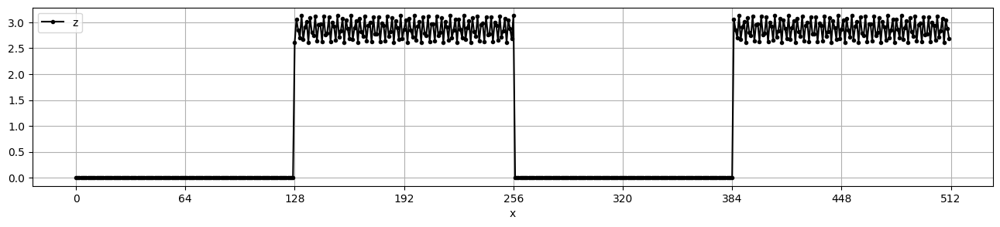
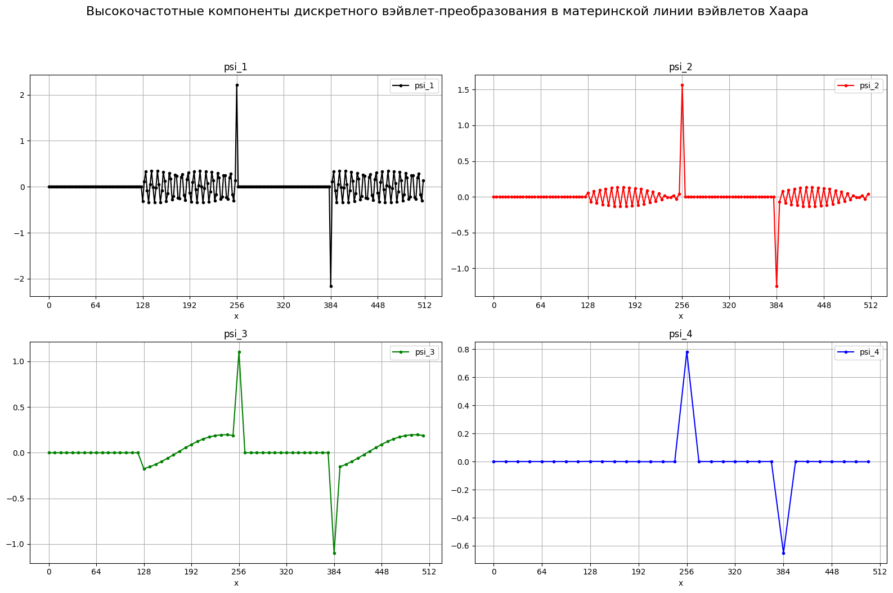
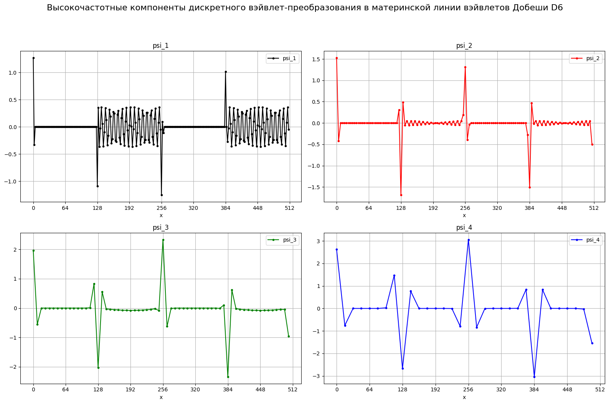
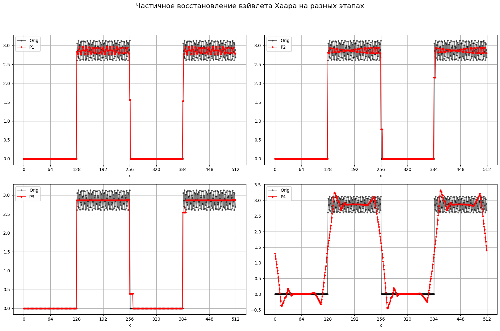
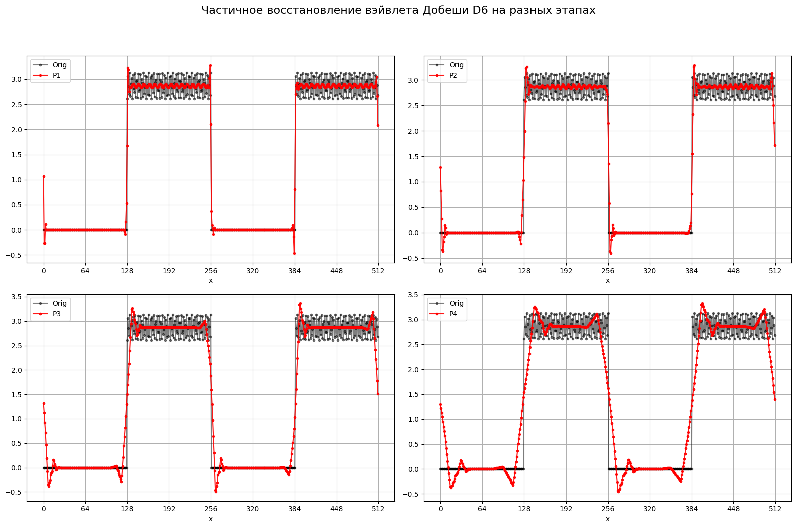
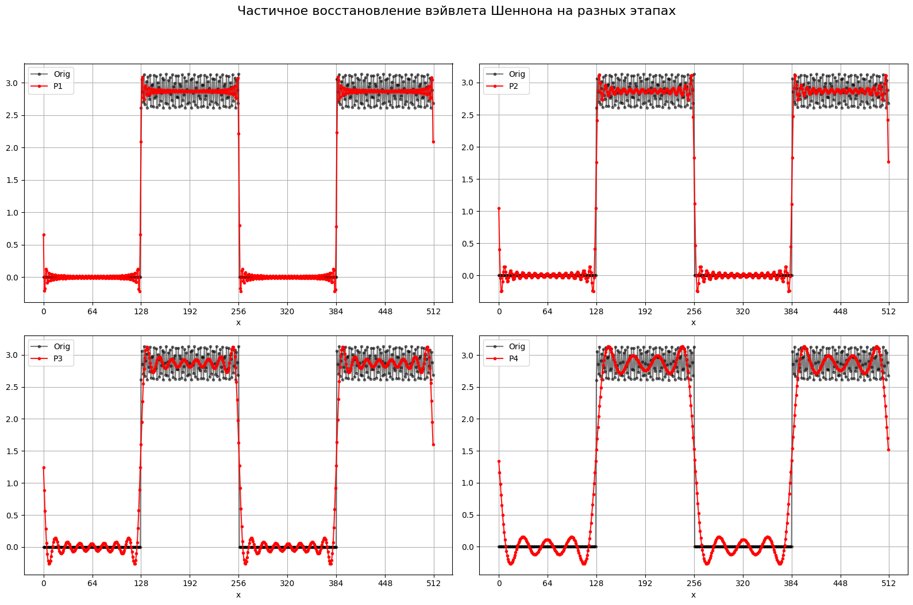
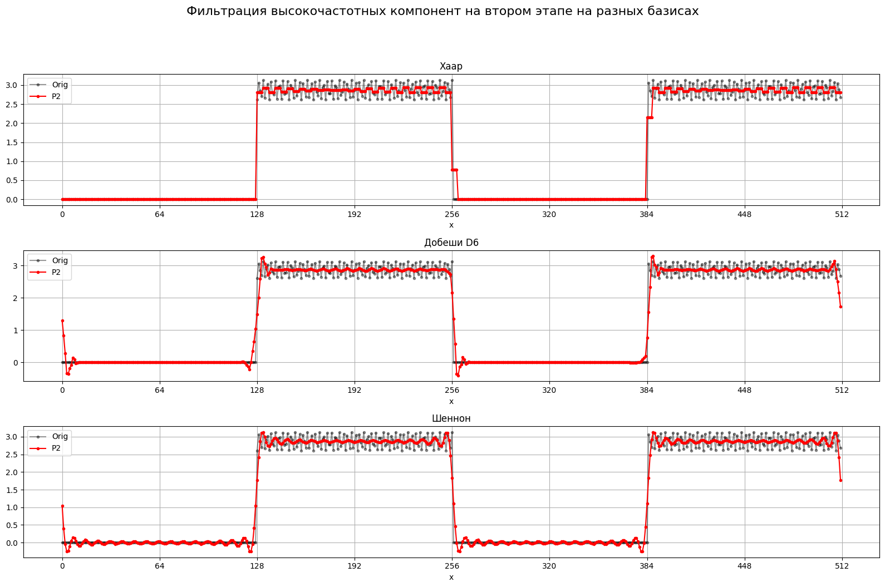
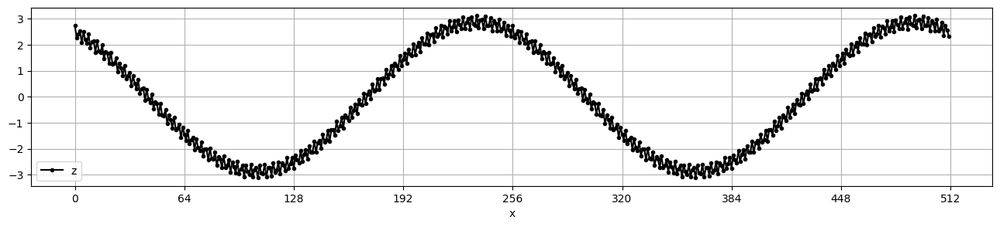
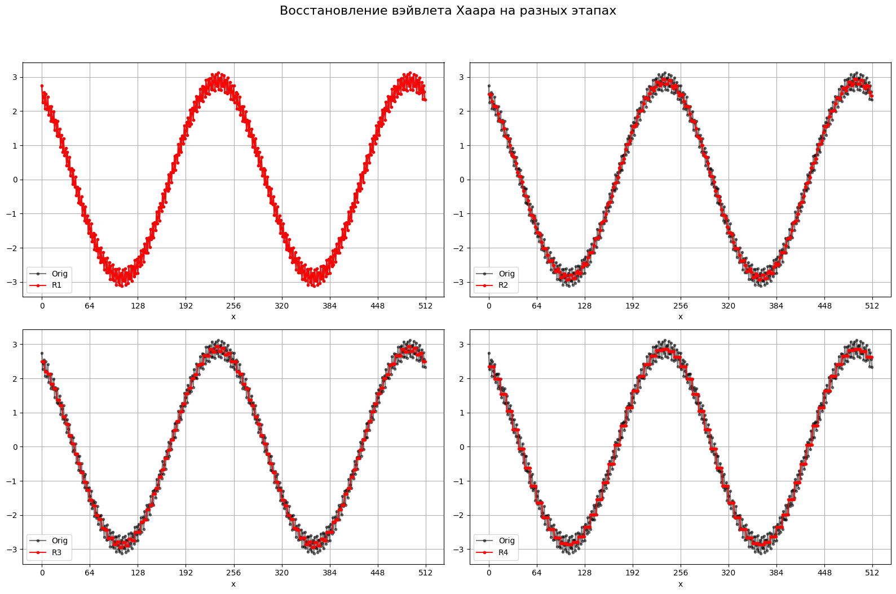
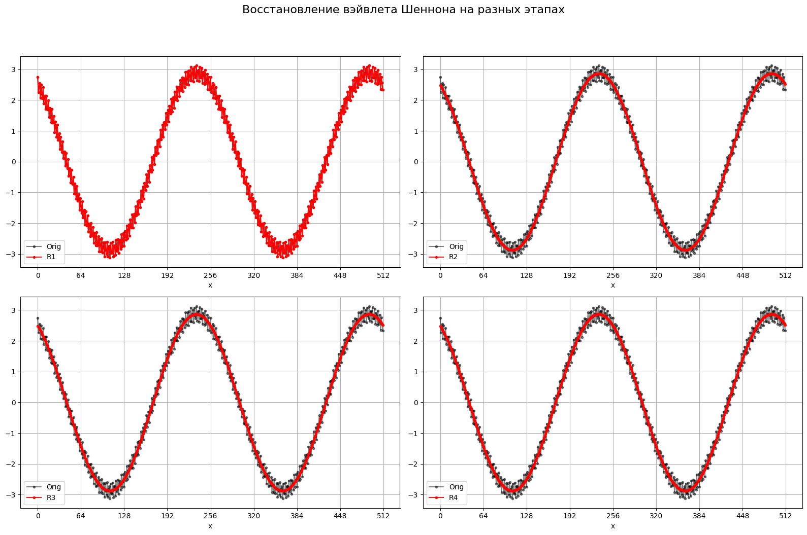

## Практическое задание №7

Выполнил: Веселый Д. А.

Группа: пми-32

Вариант: 7

### **Цель**:

Сформировать практические навыки применения методов дискретного вэйвлет-преобразования для анализа одномерных сигналов на основе разных базисных вэйвлет-систем.

### **Формулировка задания.**

1. На языке программирования С++ реализовать алгоритмы кратномасштабного анализа на базе вэйвлетов Хаара, Шеннона и Добеши (D6).
2. Задать $N = 2^n, n \in \N$ отсчётов зашумлённого кусочно-постоянного сигнала вида:
$$z(j)=\begin{cases}0, 0 \leq j < N/4, \\ A+B\cos(2\pi \omega_2 j/N), N/4\leq j\leq N/2,\\ 0, N/2<j\leq 3N/4,\\ A+B\cos(2\pi \omega_2 j/N), 3N/4<j\leq N.\end{cases}$$
3. Выполните 4-этапный кратномасштабный анализ этого сигнала: приведите графические изображения скалярных произведений $\langle z,\psi_{-1,k}\rangle$, $\langle z, \psi_{-2,k}\rangle$, $\langle z, \psi_{-3,k}\rangle$ и $\langle z, \psi_{-4,k}\rangle$. Проанализируйте эти графики при использовании вэйвлетов Хаара, Шеннона и Добеши (D6).
4. Выполните частичное восстановление сигнала на каждом из этапов $P_{-1}(z), P_{-2}(z), P_{-3}(z)$. Проанализируйте их графики при использовании вэйвлетов Хаара, Шеннона и Добеши (D6). Как ведёт себя
зашумление при переходе от этапа к этапу?
5. Попробуйте решить задачу о фильтрации зашумлённого сигнала на втором этапе: обнулите высокочастотные коэффициенты вэйвлет-разложения $\langle z, \psi_{-2,k}\rangle$ и постройте $P_{-1}(z)$. В каком базисе задача о фильтрации кусочно-постоянного сигнала может быть решена точнее?
6. Задать $N = 2^n, n \in \N$ отсчётов зашумлённого кусочно-постоянного сигнала вида: $$z(j)=A\cos(2\pi\omega_1j/N+\phi)+B\cos(2\pi\omega_2j/N)$$
7. Какой вэйвлет-базис предпочтительнее и сколько этапов потребуется для решения задачи о фильтрации такого сигнала?
8. Сформулируйте общий вывод: когда следует применять дискретное преобразование Фурье, а когда дискретное вэйвлет-преобразование?
### Исходные данные

|№ варианта|n|A|B|$\omega_1$|$\omega_2$|$\phi$|
|---|---|---|---|---|---|---|
|7|9|2.87|0.26|2|194|$\pi$/6|

### Задание 3:
#### Начальный вид сигнала

#### Высокочастотные компоненты дискретного вэйвлет-преобразования в материнской линии вэйвлетов Хаара

В местах разрыва видны пики амплитуды, потому что вейвлеты Хаара имеют прямоугольную форму, при совпадении с разрывом происходит максимальное расхождение между левой и правой частями сигнала.
#### Высокочастотные компоненты дискретного вэйвлет-преобразования в материнской линии вэйвлетов Добеши D6

Показывает низкие и высокие частоты точнее, чем вейвлет Хаара, ближе к исходному сигналу. На разрывах пики менее острые.
Это делает его более применимым для анализа плавных сигналов, но определять локализацию резких разрывов лучше с помощью вейвлета Хаара.
#### Высокочастотные компоненты дискретного вэйвлет-преобразования в материнской линии вэйвлетов Шеннона

Вейвлет Шеннона показывает точный результат с хорошо выраженной частотной локализацией, однако точное время разрыва по нему определить невозможно. Поэтому он хорошо подойдёт для гармонических сигналов, но плох для сигналов с резкими разрывами.

### Задание 4.

В базисе Хаара с ростом этапа высокие частоты оказывают всё меньшее виляние, на 3 этапе сигнал можно назвать *отфильтрованным* по высоким частотам, а на 4 этапе сигнал уже портится. До 4 этапа вэйвлет отлично сохраняет форму низких частот.

    

В базисе Добеши, как и в Хааре, с каждым этапом высокочастотная компонента уменьшается. Но в базисе Добеши, в отличие от Хаара уже начиная с 1 этапа копится ошибка в местах разрыва в низкочастотной компоненте и он хуже сохраняет форму сигнала. 
   

В базисе Шеннона заметно сохранение как низких частот, так и высоких, что приводит к ошибке на прямых участках начиная с первого этапа.
#### Вывод: 
На данном сигнале себя лучше всего показал базис Хаара, так как потери были в высоких частотах, которые не несут полезной информации.

### Задание 5.

#### Вывод: 
Вейвлеты Добеши и Шеннона дают значительные скачки амплитуды в окрестностях точек разрывов, в то время как вейвлет Хаара, хоть и не устраняет полностью шум на постоянных участках, хорошо показывает, где именно находятся резкие скачки сигнала. 
Базис Шеннона меньше всего подходит для решения задачи о фильтрации зашумлённого сигнала, так как он плохо справляется с подавлением шума и искажает сигнал вблизи резких скачков.
Из всех трёх рассмотренных базисов наилучшим выбором для фильтрации является вейвлет Хаара, так как он по сравнению с другими наиболее точно передаёт форму сигнала. Несмотря на остающийся шум, результат его применения ближе всего к идеальному востановленному сигналу.

### Задание 6 - 7.
#### Начальный сигнал

#### Восстановление вэйвлета Хаара на разных этапах

#### Восстановление вэйвлета Добеши D6 на разных этапах

#### Восстановление вэйвлета Шеннона на разных этапах

#### Вывод
В базисе Хаара сигнал с каждым этапом становится более ступенчатым, что делает его плохим выбором для фильтрации гармонического сигнала.
Вэйвлеты Добеши и Шеннона хорошо фильтруют сигнал начиная с 2 этапа, но лучший результат у Шеннона.

### Задание 8. Вывод
При анализе кусочно-постоянного сигнала с резкими разрывами наилучшие результаты показал вейвлет Хаара - он обеспечивает точную локализацию точек разрыва. Вейвлеты Добеши и Шеннона хуже справляются с резкими изменениями и приводя к искажениям в окрестностях разрыва.

При фильтрации кусочно-постоянного сигнала также лучше всего себя показал базис Хаара, так как он лучше всех сохранил общую структуру сигнала (хоть и не полностью устранил шум). Базис Добеши и Шеннона порождают сильные искажения у границ участков.

Для зашумлённого гармонического сигнала наилучшее качество восстановления показывают вейвлеты Добеши и Шеннона, которые плавно аппроксимируют сигнал синусоидальной формы и эффективно подавляет шум. Вейвлет Хаара, оказался наименее подходящим для таких сигналов из-за ступенчатого характера своей аппроксимации.

DFT можно использовать на гармонических сигналах без разрывов, но на кусочно-постоянных сигналах он даёт ошибку из-за отсутстивия локализованности, вэйвлеты решают эту проблему и могут использоваться в кусочно-постоянных сигналах