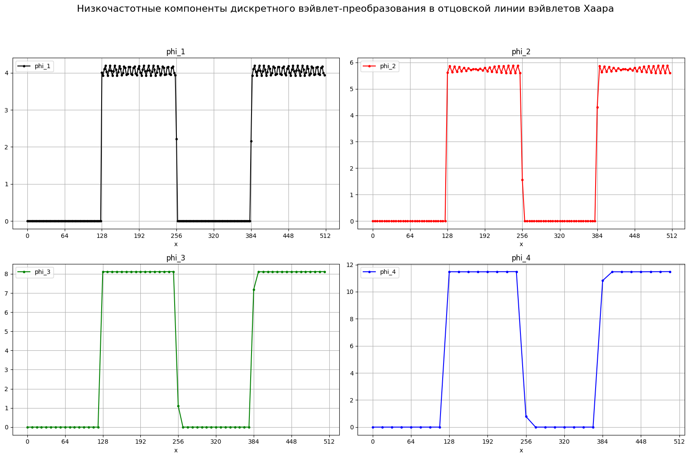
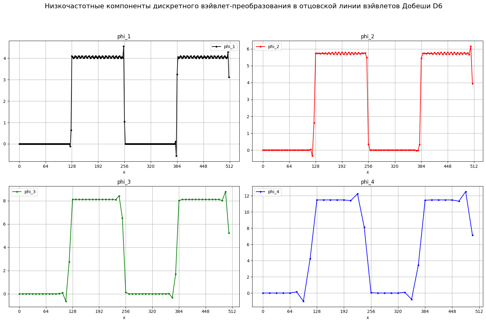
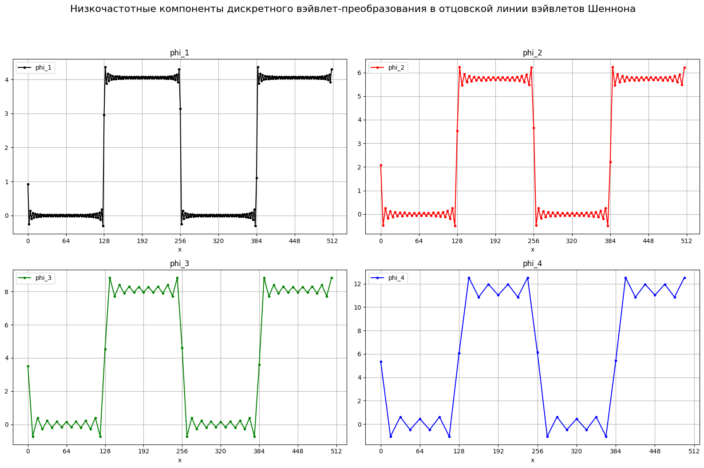

# Практическое задание №7
### вариант 7


```python
import pandas as pd
import matplotlib.pyplot as plt
```

### 2. Задать $N = 2^n, n \in N$ отсчётов зашумлённого кусочно-постоянного сигнала вида:
$$z(j)=\begin{cases}0, 0 \leq j < N/4, \\ A+B\cos(2\pi \omega_2 j/N), N/4\leq j\leq N/2,\\ 0, N/2<j\leq 3N/4,\\ A+B\cos(2\pi \omega_2 j/N), 3N/4<j\leq N.\end{cases}$$
### 3. Выполните 4-этапный кратномасштабный анализ этого сигнала: приведите графические изображения скалярных произведений $\langle z,\phi_{-1,k}\rangle$, $\langle z, \psi_{-2,k}\rangle$, $\langle z, \psi_{-3,k}\rangle$ и $\langle z, \psi_{-4,k}\rangle$. Проанализируйте эти графики при использовании вэйвлетов Хаара, Шеннона и Добеши (D6).
#### Начальный сигнал


```python
df = pd.read_csv('data3/signal1.csv')
df['x'] = range(0, df.size)
ax = df.plot(x='x', y='z', grid=True, figsize=(16, 3), style='.-', color='black')
ax.set_xticks([i for i in range(0, 512+1, 64)])
ax.grid(True, which='major', axis='x', alpha=1, linestyle='-')
```


    

    


#### Высокочастотные компоненты дискретного вэйвлет-преобразования в материнской линии вэйвлетов Хаара


```python
fig, ((ax1, ax2), (ax3, ax4)) = plt.subplots(2, 2, figsize=(16, 10))

df1 = pd.read_csv('data3/kPsi_1.csv')
df1.plot(x='x', y='z', style='.-', color='black', label='psi_1', title='psi_1', ax=ax1)
ax1.grid(True)
ax1.set_xticks([i for i in range(0, 513, 64)])

df2 = pd.read_csv('data3/kPsi_2.csv')
df2.plot(x='x', y='z', style='.-', color='red', label='psi_2', ax=ax2, title='psi_2')
ax2.grid(True)
ax2.set_xticks([i for i in range(0, 513, 64)])

df3 = pd.read_csv('data3/kPsi_3.csv')
df3.plot(x='x', y='z', style='.-', color='green', label='psi_3', ax=ax3, title='psi_3')
ax3.grid(True)
ax3.set_xticks([i for i in range(0, 513, 64)])

df4 = pd.read_csv('data3/kPsi_4.csv')
df4.plot(x='x', y='z', style='.-', color='blue', label='psi_4', ax=ax4, title='psi_4')
ax4.grid(True)
ax4.set_xticks([i for i in range(0, 513, 64)])
fig.suptitle('Высокочастотные компоненты дискретного вэйвлет-преобразования в материнской линии вэйвлетов Хаара', fontsize=16, y=1.05)
plt.tight_layout()
plt.show()
```


    

    


В местах разрыва видны пики амплитуды, потому что вейвлеты Хаара имеют прямоугольную форму, при совпадении с разрывом происходит максимальное расхождение между левой и правой частями сигнала.

#### Низкочастотные компоненты дискретного вэйвлет-преобразования в отцовской линии вэйвлетов Хаара


```python
fig, ((ax1, ax2), (ax3, ax4)) = plt.subplots(2, 2, figsize=(16, 10))

df1 = pd.read_csv('data3/kPhi_1.csv')
df1.plot(x='x', y='z', style='.-', color='black', label='phi_1', title='phi_1', ax=ax1)
ax1.grid(True)
ax1.set_xticks([i for i in range(0, 513, 64)])

df2 = pd.read_csv('data3/kPhi_2.csv')
df2.plot(x='x', y='z', style='.-', color='red', label='phi_2', ax=ax2, title='phi_2')
ax2.grid(True)
ax2.set_xticks([i for i in range(0, 513, 64)])

df3 = pd.read_csv('data3/kPhi_3.csv')
df3.plot(x='x', y='z', style='.-', color='green', label='phi_3', ax=ax3, title='phi_3')
ax3.grid(True)
ax3.set_xticks([i for i in range(0, 513, 64)])

df4 = pd.read_csv('data3/kPhi_4.csv')
df4.plot(x='x', y='z', style='.-', color='blue', label='phi_4', ax=ax4, title='phi_4')
ax4.grid(True)
ax4.set_xticks([i for i in range(0, 513, 64)])
fig.suptitle('Низкочастотные компоненты дискретного вэйвлет-преобразования в отцовской линии вэйвлетов Хаара', fontsize=16, y=1.05)
plt.tight_layout()
plt.show()
```


    

    


#### Высокочастотные компоненты дискретного вэйвлет-преобразования в материнской линии вэйвлетов Добеши D6


```python
fig, ((ax1, ax2), (ax3, ax4)) = plt.subplots(2, 2, figsize=(16, 10))

df1 = pd.read_csv('data4/kPsi_1.csv')
df1.plot(x='x', y='z', style='.-', color='black', label='psi_1', title='psi_1', ax=ax1)
ax1.grid(True)
ax1.set_xticks([i for i in range(0, 513, 64)])

df2 = pd.read_csv('data4/kPsi_2.csv')
df2.plot(x='x', y='z', style='.-', color='red', label='psi_2', ax=ax2, title='psi_2')
ax2.grid(True)
ax2.set_xticks([i for i in range(0, 513, 64)])

df3 = pd.read_csv('data4/kPsi_3.csv')
df3.plot(x='x', y='z', style='.-', color='green', label='psi_3', ax=ax3, title='psi_3')
ax3.grid(True)
ax3.set_xticks([i for i in range(0, 513, 64)])

df4 = pd.read_csv('data4/kPsi_4.csv')
df4.plot(x='x', y='z', style='.-', color='blue', label='psi_4', ax=ax4, title='psi_4')
ax4.grid(True)
ax4.set_xticks([i for i in range(0, 513, 64)])
fig.suptitle('Высокочастотные компоненты дискретного вэйвлет-преобразования в материнской линии вэйвлетов Добеши D6', fontsize=16, y=1.05)
plt.tight_layout()
plt.show()
```


    

    


Показывает низкие и высокие частоты точнее, чем вейвлет Хаара, ближе к исходному сигналу. На разрывах пики менее острые.
Это делает его более применимым для анализа плавных сигналов, но определять локализацию резких разрывов лучше с помощью вейвлета Хаара.

#### Низкочастотные компоненты дискретного вэйвлет-преобразования в отцовской линии вэйвлетов Добеши D6


```python
fig, ((ax1, ax2), (ax3, ax4)) = plt.subplots(2, 2, figsize=(16, 10))

df1 = pd.read_csv('data4/kPhi_1.csv')
df1.plot(x='x', y='z', style='.-', color='black', label='phi_1', title='phi_1', ax=ax1)
ax1.grid(True)
ax1.set_xticks([i for i in range(0, 513, 64)])

df2 = pd.read_csv('data4/kPhi_2.csv')
df2.plot(x='x', y='z', style='.-', color='red', label='phi_2', ax=ax2, title='phi_2')
ax2.grid(True)
ax2.set_xticks([i for i in range(0, 513, 64)])

df3 = pd.read_csv('data4/kPhi_3.csv')
df3.plot(x='x', y='z', style='.-', color='green', label='phi_3', ax=ax3, title='phi_3')
ax3.grid(True)
ax3.set_xticks([i for i in range(0, 513, 64)])

df4 = pd.read_csv('data4/kPhi_4.csv')
df4.plot(x='x', y='z', style='.-', color='blue', label='phi_4', ax=ax4, title='phi_4')
ax4.grid(True)
ax4.set_xticks([i for i in range(0, 513, 64)])
fig.suptitle('Низкочастотные компоненты дискретного вэйвлет-преобразования в отцовской линии вэйвлетов Добеши D6', fontsize=16, y=1.05)
plt.tight_layout()
plt.show()
```


    

    


#### Высокочастотные компоненты дискретного вэйвлет-преобразования в материнской линии вэйвлетов Шеннона


```python
fig, ((ax1, ax2), (ax3, ax4)) = plt.subplots(2, 2, figsize=(16, 10))

df1 = pd.read_csv('data5/kPsi_1.csv')
df1.plot(x='x', y='z', style='.-', color='black', label='psi_1', title='psi_1', ax=ax1)
ax1.grid(True)
ax1.set_xticks([i for i in range(0, 513, 64)])

df2 = pd.read_csv('data5/kPsi_2.csv')
df2.plot(x='x', y='z', style='.-', color='red', label='psi_2', ax=ax2, title='psi_2')
ax2.grid(True)
ax2.set_xticks([i for i in range(0, 513, 64)])

df3 = pd.read_csv('data5/kPsi_3.csv')
df3.plot(x='x', y='z', style='.-', color='green', label='psi_3', ax=ax3, title='psi_3')
ax3.grid(True)
ax3.set_xticks([i for i in range(0, 513, 64)])

df4 = pd.read_csv('data5/kPsi_4.csv')
df4.plot(x='x', y='z', style='.-', color='blue', label='psi_4', ax=ax4, title='psi_4')
ax4.grid(True)
ax4.set_xticks([i for i in range(0, 513, 64)])
fig.suptitle('Высокочастотные компоненты дискретного вэйвлет-преобразования в материнской линии вэйвлетов Шеннона', fontsize=16, y=1.05)
plt.tight_layout()
plt.show()
```


    

    


Вейвлет Шеннона показывает точный результат с хорошо выраженной частотной локализацией, однако точное время разрыва по нему определить невозможно. Поэтому он хорошо подойдёт для гармонических сигналов, но плох для сигналов с резкими разрывами.

#### Низкочастотные компоненты дискретного вэйвлет-преобразования в отцовской линии вэйвлетов Шеннона


```python
fig, ((ax1, ax2), (ax3, ax4)) = plt.subplots(2, 2, figsize=(16, 10))

df1 = pd.read_csv('data5/kPhi_1.csv')
df1.plot(x='x', y='z', style='.-', color='black', label='phi_1', title='phi_1', ax=ax1)
ax1.grid(True)
ax1.set_xticks([i for i in range(0, 513, 64)])

df2 = pd.read_csv('data5/kPhi_2.csv')
df2.plot(x='x', y='z', style='.-', color='red', label='phi_2', ax=ax2, title='phi_2')
ax2.grid(True)
ax2.set_xticks([i for i in range(0, 513, 64)])

df3 = pd.read_csv('data5/kPhi_3.csv')
df3.plot(x='x', y='z', style='.-', color='green', label='phi_3', ax=ax3, title='phi_3')
ax3.grid(True)
ax3.set_xticks([i for i in range(0, 513, 64)])

df4 = pd.read_csv('data5/kPhi_4.csv')
df4.plot(x='x', y='z', style='.-', color='blue', label='phi_4', ax=ax4, title='phi_4')
ax4.grid(True)
ax4.set_xticks([i for i in range(0, 513, 64)])
fig.suptitle('Низкочастотные компоненты дискретного вэйвлет-преобразования в отцовской линии вэйвлетов Шеннона', fontsize=16, y=1.05)
plt.tight_layout()
plt.show()
```


    

    


### 4. Выполните частичное восстановление сигнала на каждом из этапов $P_{-1}(z), P_{-2}(z), P_{-3}(z)$. Проанализируйте их графики при использовании вэйвлетов Хаара, Шеннона и Добеши (D6). Как ведёт себя зашумление при переходе от этапа к этапу?


```python
fig, ((ax1, ax2), (ax3, ax4)) = plt.subplots(2, 2, figsize=(16, 10))

df1 = pd.read_csv('data3/signal1.csv')
dfp1 = pd.read_csv('data3/P_1.csv')
df1['x'] = dfp1['x'] = df['x']
df1.plot(x='x', y='z', style='.-', color='black', label='Orig', ax=ax1, alpha=0.5)
dfp1.plot(x='x', y='z', style='.-', color='red', label='P1', ax=ax1, alpha=0.9)
ax1.grid(True)
ax1.set_xticks([i for i in range(0, 513, 64)])

df2 = pd.read_csv('data3/signal1.csv')
dfp2 = pd.read_csv('data3/P_2.csv')
df2['x'] = dfp2['x'] = df['x']
df2.plot(x='x', y='z', style='.-', color='black', label='Orig', ax=ax2, alpha=0.5)
dfp2.plot(x='x', y='z', style='.-', color='red', label='P2', ax=ax2, alpha=0.9)
ax2.grid(True)
ax2.set_xticks([i for i in range(0, 513, 64)])

df3 = pd.read_csv('data3/signal1.csv')
dfp3 = pd.read_csv('data3/P_3.csv')
df3['x'] = dfp3['x'] = df['x']
df3.plot(x='x', y='z', style='.-', color='black', label='Orig', ax=ax3, alpha=0.5)
dfp3.plot(x='x', y='z', style='.-', color='red', label='P3', ax=ax3, alpha=0.9)
ax3.grid(True)
ax3.set_xticks([i for i in range(0, 513, 64)])

df4 = pd.read_csv('data3/signal1.csv')
dfp4 = pd.read_csv('data4/P_4.csv')
df4['x'] = dfp4['x'] = df['x']
df4.plot(x='x', y='z', style='.-', color='black', label='Orig', ax=ax4, alpha=0.5)
dfp4.plot(x='x', y='z', style='.-', color='red', label='P4', ax=ax4, alpha=0.9)
ax4.grid(True)
ax4.set_xticks([i for i in range(0, 513, 64)])
fig.suptitle('Частичное восстановление вэйвлета Хаара на разных этапах', fontsize=16, y=1.05)
plt.tight_layout()
plt.show()
```


    

    


в базисе Хаара с ростом этапа высокие частоты оказывают всё меньшее виляние, на 3 этапе сигнал можно назвать *отфильтрованным* по высоким частотам, а на 4 этапе сигнал уже портится. До 4 этапа сигнал отлично сохраняет форму низких частот.


```python
fig, ((ax1, ax2), (ax3, ax4)) = plt.subplots(2, 2, figsize=(16, 10))

df1 = pd.read_csv('data3/signal1.csv')
dfp1 = pd.read_csv('data4/P_1.csv')
df1['x'] = dfp1['x'] = df['x']
df1.plot(x='x', y='z', style='.-', color='black', label='Orig', ax=ax1, alpha=0.5)
dfp1.plot(x='x', y='z', style='.-', color='red', label='P1', ax=ax1, alpha=0.9)
ax1.grid(True)
ax1.set_xticks([i for i in range(0, 513, 64)])

df2 = pd.read_csv('data3/signal1.csv')
dfp2 = pd.read_csv('data4/P_2.csv')
df2['x'] = dfp2['x'] = df['x']
df2.plot(x='x', y='z', style='.-', color='black', label='Orig', ax=ax2, alpha=0.5)
dfp2.plot(x='x', y='z', style='.-', color='red', label='P2', ax=ax2, alpha=0.9)
ax2.grid(True)
ax2.set_xticks([i for i in range(0, 513, 64)])

df3 = pd.read_csv('data3/signal1.csv')
dfp3 = pd.read_csv('data4/P_3.csv')
df3['x'] = dfp3['x'] = df['x']
df3.plot(x='x', y='z', style='.-', color='black', label='Orig', ax=ax3, alpha=0.5)
dfp3.plot(x='x', y='z', style='.-', color='red', label='P3', ax=ax3, alpha=0.9)
ax3.grid(True)
ax3.set_xticks([i for i in range(0, 513, 64)])

df4 = pd.read_csv('data3/signal1.csv')
dfp4 = pd.read_csv('data4/P_4.csv')
df4['x'] = dfp4['x'] = df['x']
df4.plot(x='x', y='z', style='.-', color='black', label='Orig', ax=ax4, alpha=0.5)
dfp4.plot(x='x', y='z', style='.-', color='red', label='P4', ax=ax4, alpha=0.9)
ax4.grid(True)
ax4.set_xticks([i for i in range(0, 513, 64)])
fig.suptitle('Частичное восстановление вэйвлета Добеши D6 на разных этапах', fontsize=16, y=1.05)
plt.tight_layout()
plt.show()
```


    

    


В базисе Добеши, как и в Хааре, с каждым этапом высокочастотная компонента уменьшается. Но в базисе Добеши, в отличие от Хаара уже начиная с 1 этапа копится ошибка в местах разрыва в низкочастотной компоненте и он хуже сохраняет форму сигнала.  


```python
fig, ((ax1, ax2), (ax3, ax4)) = plt.subplots(2, 2, figsize=(16, 10))

df1 = pd.read_csv('data3/signal1.csv')
dfp1 = pd.read_csv('data5/P_1.csv')
df1['x'] = dfp1['x'] = df['x']
df1.plot(x='x', y='z', style='.-', color='black', label='Orig', ax=ax1, alpha=0.5)
dfp1.plot(x='x', y='z', style='.-', color='red', label='P1', ax=ax1, alpha=0.9)
ax1.grid(True)
ax1.set_xticks([i for i in range(0, 513, 64)])

df2 = pd.read_csv('data3/signal1.csv')
dfp2 = pd.read_csv('data5/P_2.csv')
df2['x'] = dfp2['x'] = df['x']
df2.plot(x='x', y='z', style='.-', color='black', label='Orig', ax=ax2, alpha=0.5)
dfp2.plot(x='x', y='z', style='.-', color='red', label='P2', ax=ax2, alpha=0.9)
ax2.grid(True)
ax2.set_xticks([i for i in range(0, 513, 64)])

df3 = pd.read_csv('data3/signal1.csv')
dfp3 = pd.read_csv('data5/P_3.csv')
df3['x'] = dfp3['x'] = df['x']
df3.plot(x='x', y='z', style='.-', color='black', label='Orig', ax=ax3, alpha=0.5)
dfp3.plot(x='x', y='z', style='.-', color='red', label='P3', ax=ax3, alpha=0.9)
ax3.grid(True)
ax3.set_xticks([i for i in range(0, 513, 64)])

df4 = pd.read_csv('data3/signal1.csv')
dfp4 = pd.read_csv('data5/P_4.csv')
df4['x'] = dfp4['x'] = df['x']
df4.plot(x='x', y='z', style='.-', color='black', label='Orig', ax=ax4, alpha=0.5)
dfp4.plot(x='x', y='z', style='.-', color='red', label='P4', ax=ax4, alpha=0.9)
ax4.grid(True)
ax4.set_xticks([i for i in range(0, 513, 64)])
fig.suptitle('Частичное восстановление вэйвлета Шеннона на разных этапах', fontsize=16, y=1.05)
plt.tight_layout()
plt.show()
```


    

    


В базисе Шеннона заметно сохранение как низких частот, так и высоких, что приводит к ошибке на прямых участках начиная с первого этапа.

Вывод: на данном сигнале себя лучше всего показал базис Хаара, так как потери были в высоких частотах, которые не несут полезной информации.

### 5. Попробуйте решить задачу о фильтрации зашумлённого сигнала на втором этапе: обнулите высокочастотные коэффициенты вэйвлет-разложения $\langle z, \psi_{-2,k}\rangle$ и постройте $P_{-1}(z)$. В каком базисе задача о фильтрации кусочно-постоянного сигнала может быть решена точнее?


```python
fig, ((ax1, ax2, ax3)) = plt.subplots(3, 1, figsize=(16, 10))

df1 = pd.read_csv('data6/signal1.csv')
dfp1 = pd.read_csv('data6/P_2.csv')
df1['x'] = dfp1['x'] = df['x']
dfp2 = pd.read_csv('data7/P_2.csv')
dfp2['x'] = df['x']
dfp3 = pd.read_csv('data8/P_2.csv')
dfp3['x'] = df['x']
for i in [ax1, ax2, ax3]:
  df1.plot(x='x', y='z', style='.-', color='black', label='Orig', ax=i, alpha=0.4)
dfp1.plot(x='x', y='z', style='.-', color='red', label='P2', title='Хаар', ax=ax1)
dfp2.plot(x='x', y='z', style='.-', color='red', label='P2', title='Добеши D6', ax=ax2)
dfp3.plot(x='x', y='z', style='.-', color='red', label='P2', title='Шеннон', ax=ax3)
for i in [ax1, ax2, ax3]:
  i.grid(True)
  i.set_xticks([i for i in range(0, 513, 64)])
fig.suptitle('Фильтрация высокочастотных компонент на втором этапе на разных базисах', fontsize=16, y=1.05)
plt.tight_layout()
plt.show()
```


    

    


Вывод: Вейвлеты Добеши и Шеннона дают значительные скачки амплитуды в окрестностях точек разрывов, в то время как вейвлет Хаара, хоть и не устраняет полностью шум на постоянных участках, хорошо показывает, где именно находятся резкие скачки сигнала. 
Базис Шеннона меньше всего подходит для решения задачи о фильтрации зашумлённого сигнала, так как он плохо справляется с подавлением шума и искажает сигнал вблизи резких скачков.
Из всех трёх рассмотренных базисов наилучшим выбором для фильтрации является вейвлет Хаара, так как он по сравнению с другими наиболее точно передаёт форму сигнала. Несмотря на остающийся шум, результат его применения ближе всего к идеальному востановленному сигналу.

### 6. Задать $N = 2^n, n \in N$ отсчётов зашумлённого кусочно-постоянного сигнала вида: $$z(j)=A\cos(2\pi\omega_1j/N+\phi)+B\cos(2\pi\omega_2j/N)$$ 7. Какой вэйвлет-базис предпочтительнее и сколько этапов потребуется для решения задачи о фильтрации такого сигнала?
#### Начальынй сигнал


```python
df = pd.read_csv('data9/signal1.csv')
df['x'] = range(0, df.size)
ax = df.plot(x='x', y='z', grid=True, figsize=(16, 3), style='.-', color='black')
ax.set_xticks([i for i in range(0, 512+1, 64)])
ax.grid(True, which='major', axis='x', alpha=1, linestyle='-')
```


    

    


#### Восстановление вэйвлета Хаара на разных этапах


```python
fig, ((ax1, ax2), (ax3, ax4)) = plt.subplots(2, 2, figsize=(16, 10))

df1 = pd.read_csv('data9/signal1.csv')
dfp1 = pd.read_csv('data9/R_1.csv')
dfp2 = pd.read_csv('data9/R_2.csv')
dfp3 = pd.read_csv('data9/R_3.csv')
dfp4 = pd.read_csv('data9/R_4.csv')
dfp4['x'] = dfp3['x'] = dfp2['x'] = dfp1['x'] = df1['x'] = df['x']
for i in [ax1, ax2, ax3, ax4]:
  df1.plot(x='x', y='z', style='.-', color='black', label='Orig', ax=i, alpha=0.5)
dfp1.plot(x='x', y='z', style='.-', color='red', label='R1', ax=ax1, alpha=0.9)
dfp2.plot(x='x', y='z', style='.-', color='red', label='R2', ax=ax2, alpha=0.9)
dfp3.plot(x='x', y='z', style='.-', color='red', label='R3', ax=ax3, alpha=0.9)
dfp4.plot(x='x', y='z', style='.-', color='red', label='R4', ax=ax4, alpha=0.9)
for i in [ax1, ax2, ax3, ax4]:
  i.grid(True)
  i.set_xticks([i for i in range(0, 513, 64)])
fig.suptitle('Восстановление вэйвлета Хаара на разных этапах', fontsize=16, y=1.05)
plt.tight_layout()
plt.show()
```


    

    


#### Восстановление вэйвлета Добеши D6 на разных этапах


```python
fig, ((ax1, ax2), (ax3, ax4)) = plt.subplots(2, 2, figsize=(16, 10))

df1 = pd.read_csv('data9/signal1.csv')
dfp1 = pd.read_csv('data10/R_1.csv')
dfp2 = pd.read_csv('data10/R_2.csv')
dfp3 = pd.read_csv('data10/R_3.csv')
dfp4 = pd.read_csv('data10/R_4.csv')
dfp4['x'] = dfp3['x'] = dfp2['x'] = dfp1['x'] = df1['x'] = df['x']
for i in [ax1, ax2, ax3, ax4]:
  df1.plot(x='x', y='z', style='.-', color='black', label='Orig', ax=i, alpha=0.5)
dfp1.plot(x='x', y='z', style='.-', color='red', label='R1', ax=ax1, alpha=0.9)
dfp2.plot(x='x', y='z', style='.-', color='red', label='R2', ax=ax2, alpha=0.9)
dfp3.plot(x='x', y='z', style='.-', color='red', label='R3', ax=ax3, alpha=0.9)
dfp4.plot(x='x', y='z', style='.-', color='red', label='R4', ax=ax4, alpha=0.9)
for i in [ax1, ax2, ax3, ax4]:
  i.grid(True)
  i.set_xticks([i for i in range(0, 513, 64)])
fig.suptitle('Восстановление вэйвлета Добеши D6 на разных этапах', fontsize=16, y=1.05)
plt.tight_layout()
plt.show()
```


    

    


#### Восстановление вэйвлета Шеннона на разных этапах


```python
fig, ((ax1, ax2), (ax3, ax4)) = plt.subplots(2, 2, figsize=(16, 10))

df1 = pd.read_csv('data9/signal1.csv')
dfp1 = pd.read_csv('data11/R_1.csv')
dfp2 = pd.read_csv('data11/R_2.csv')
dfp3 = pd.read_csv('data11/R_3.csv')
dfp4 = pd.read_csv('data11/R_4.csv')
dfp4['x'] = dfp3['x'] = dfp2['x'] = dfp1['x'] = df1['x'] = df['x']
for i in [ax1, ax2, ax3, ax4]:
  df1.plot(x='x', y='z', style='.-', color='black', label='Orig', ax=i, alpha=0.5)
dfp1.plot(x='x', y='z', style='.-', color='red', label='R1', ax=ax1, alpha=0.9)
dfp2.plot(x='x', y='z', style='.-', color='red', label='R2', ax=ax2, alpha=0.9)
dfp3.plot(x='x', y='z', style='.-', color='red', label='R3', ax=ax3, alpha=0.9)
dfp4.plot(x='x', y='z', style='.-', color='red', label='R4', ax=ax4, alpha=0.9)
for i in [ax1, ax2, ax3, ax4]:
  i.grid(True)
  i.set_xticks([i for i in range(0, 513, 64)])
fig.suptitle('Восстановление вэйвлета Шеннона на разных этапах', fontsize=16, y=1.05)
plt.tight_layout()
plt.show()
```


    

    


#### Вывод
В базисе Хаара сигнал с каждым этапом становится более ступенчатым, что делает его плохим выбором для фильтрации гармонического сигнала.
Вэйвлеты Добеши и Шеннона хорошо фильтруют сигнал начиная с 2 этапа, но лучший результат у Шеннона.
