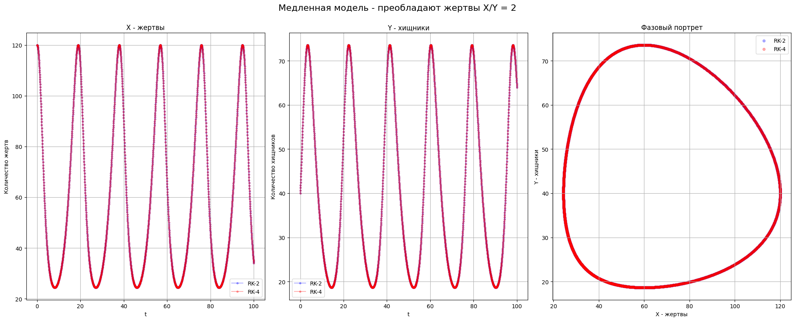
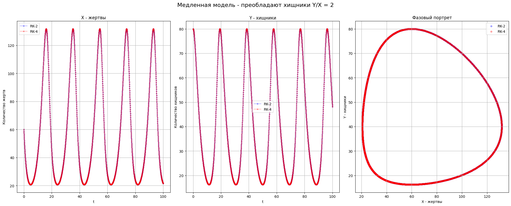
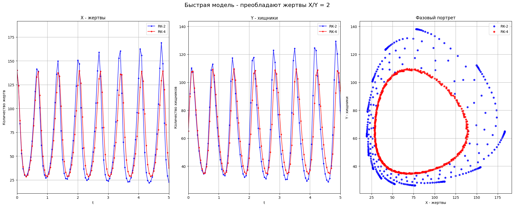
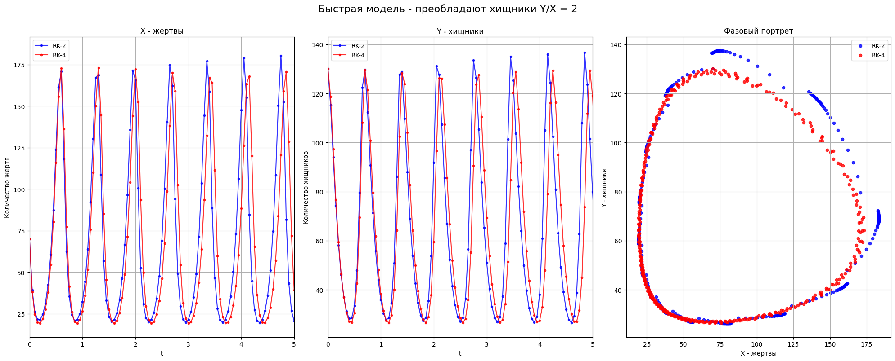

## Практическое задание №8

Выполнил: Веселый Д. А.

Группа: пми-32

Вариант: 7

### **Цель**:

Сформировать практические навыки применения дискретных методов решения задачи Коши на базе конечно-разностных аппроксимаций.

### **Формулировка задания.**

1. На языке С++ реализуйте любые две конечно-разностные схемы с разным порядком сходимости.
2. Придумайте две разномасштабные по времени жизни модели популяций: волки – зайцы, дидинии – инфузории туфельки и т.д. Подберите корректные параметры модели Лотки-Вольтерра для каждой популяции, изучите как меняется динамика численности членов популяций при варьировании параметров модели как в условиях превышения кормовой базы x0 > y0 , так и в условиях превышения хищников x0 < y0.
3. Как влияют малые отклонения численностей от их
равновесных значений на устойчивость решения задачи? Что можно сказать о свойствах математической модели Лотки-Вольтерра с точки зрения жёсткости?
4. Какие методы дискретизации данной модели предпочтительнее?
### Исходные данные

Модель Лотки-Вольтерра: 
$$\begin{cases}x'=(\alpha - \beta y)x,\\y'=(-\gamma+\delta x)y,\end{cases}$$
где $x$ – количество жертв, $y$ – количество хищников $\alpha$ –
коэффициент рождаемости жертв, $\beta$ – коэффициент
успешной охоты на жертв, $\gamma$ – коэффициент естественной
убыли хищников, $\delta$ – коэффициент воспроизводства
хищников.
### Задание 1. 
Возьмём для реализации схемы Рунге-Кутты 2-го и 4-го порядков точности. Была написана программа на C++, которая в соответствии с начальными параметрами модели Лотки-Вольтерра расчитывает точку равновесия и по начальной точке прогнозирует по схемам РК-2, РК-4 популяции, которые записывает в .csv файлы, для дальнейшего анализа этих данных и построения графиков.
### Задание 2.
Волки - зайцы: x - зайцы (жертвы), y - волки (хищники). Зайцев обычно много, волков мало.
Дидинии - инфузории туфельки: x - инфузории (жертвы), y - дидинии (хищники). Инфузории
мелкие, быстро размножаются. Дидинии крупнее, меньше по численности.

**Для волков-зайцев (медленная модель) пусть:**  
$\alpha$ = 0.4 - зайцы размножаются медленно.  
$\beta$ = 0.01 - волки не очень эффективны в охоте.  
$\gamma$ = 0.3 - волки быстро умирают без еды.  
$\delta$ = 0.005 - волки плохо размножаются.  
Точка равновесия: x = 60, y = 40  
Начальные условия:  
При случае, когда жертв больше (x0 > y0): x0 = 120, y0 = 40.  
При случае, когда хищников больше (x0 < y0): x0 = 60, y0 = 80.  
Для дидиний-инфузорий (быстрая модель):  
$\alpha$ = 13.0 - инфузории размножаются быстро.  
$\beta$ = 0.2 - дидинии эффективны в охоте.  
$\gamma$ = 7.0 - дидинии быстро умирают без еды.  
$\delta$ = 0.1 - дидинии хорошо размножаются.
Точка равновесия: x = 70, y = 65    
Начальные условия:  
При случае, когда жертв больше (x0 > y0): x0 = 140, y0 = 65.  
При случае, когда хищников больше (x0 < y0): x0 = 70, y0 = 130.  

#### Сравнение схем на медленной модели


В этой модели хищники охотятся медленно, а жертвы размножаются постепенно. Из-за этого динамика системы выходит плавной, то есть колебания происходят медленно и ошибки влияют значительно слабее, чем в более быстрой системе. Разница между методами Рунге-Кутты-4 и Рунге-Кутты-2 незаметна из-за динамики модели и они совпадают. На графике изображаются периодические колебания, что подтверждается теоретическими ожиданиями для модели Лотки-Вольтерры. Также это подтверждается фазовым портретом, траектория,
полученная этим методом замкнута, что говорит о хорошем сохранении свойств системы и
устойчивости численного решения.

#### Сравнение на быстрой модели


В быстрой модели уже видны различия между РК-4 и РК-2, в особенности по фазовому портрету. Для удобства графики жертв и хищников масштабированны до 5 дней, чтобы можно было разглядеть формы графиков, на которых заметно как с каждым периодом РК-2 накапливает ошибку. Для того, чтобы даже РК-2 давал ошибку начальные условия задачи сделанны жесткими $\alpha/\beta >> 1$ и $\gamma/\delta >> 1$
### Задание 3:
Графики показывают, что изменение начальных условий влияет на период и амплитуду колебаний. Так, в быстрой системе, даже небольшие изменения начальных значений приводят к резкому росту амплитуд и высокой чувствительности, это признак жёсткой системы. При этом система остаётся устойчивой, колебания не затухают и не расходятся, а продолжают повторяться циклически.  

Для обеих систем характерна общая динамика, которая зависит от начальных условий.
В случае, когда жертв больше: сначала, количество хищников растёт, так как много еды. Затем
хищников становится слишком много, они съедают слишком много жертв, и численность жертв
начинает резко падать. Из-за нехватки пищи хищники также начинают умирать, и количество
жертв начинает восстанавливаться. Процесс повторяется, то есть возникают периодические
колебания (цикл хищники-жертвы).

### Задание 4.

Для решения быстрой модели себя лучше подходит метод Рунге-Кутты-4, так как он обеспечивает
более высокую точность и устойчивость. Этот метод также корректно рисует графики, в том
числе фазовые портреты, представляя их в виде замкнутых траекторий и накапливает
погрешность медленнее, чем РК-2.


### Вывод.
В ходе работы я сформировал практические навыки применения дискретных методов решения задачи Коши на базе конечно-разностных аппроксимаций. Были реализованы программные дискретны методы решений модели Лотки-Вольтерра на основе явных схем Эйлера, Рунге-Кутты-2 и Рунге-Кутты-4. Был произведён анализ влияния начальных парметров модели Лотки-вольтерра и точек отсчета на решения. 

### Приложение
Код на C++:
```cpp
#include <cmath>
#include <fstream>
#include <iostream>
#include <string>
#include <vector>

using namespace std;

// Структура для параметров модели Лотки-Вольтерра
struct LVdata {
  double alpha, beta, gamma, delta;
  double x0, y0;
  double t_start, t_end, dt;
};

// Сама система дифференциальных уравнений
void phi(double x, double y, const LVdata& data, double& dx, double& dy) {
  dx = (data.alpha - data.beta * y) * x;
  dy = (-data.gamma + data.delta * x) * y;
}

// Явная схема Эйлера (1 порядок)
void euler(const LVdata& data, const string& filename) {
  ofstream file(filename);
  file << "t,x,y\n";
  double t = data.t_start, x = data.x0, y = data.y0;
  file << t << "," << x << "," << y << "\n";
  while (t < data.t_end) {
    double dx, dy;
    phi(x, y, data, dx, dy);
    x += dx * data.dt;
    y += dy * data.dt;
    t += data.dt;
    file << t << "," << x << "," << y << "\n";
  }
  file.close();
}

// Явная схема Рунге-Кутты-2 (2 порядок)
void rk2(const LVdata& data, const string& filename) {
  ofstream file(filename);
  file << "t,x,y\n";
  double t = data.t_start, x = data.x0, y = data.y0;
  file << t << "," << x << "," << y << "\n";
  while (t < data.t_end) {
    double k1_x, k1_y;
    phi(x, y, data, k1_x, k1_y);
    double k2_x, k2_y;
    phi(x + k1_x * data.dt, y + k1_y * data.dt, data, k2_x, k2_y);
    x += (data.dt / 2.0) * (k1_x + k2_x);
    y += (data.dt / 2.0) * (k1_y + k2_y);
    t += data.dt;
    file << t << "," << x << "," << y << "\n";
  }
  file.close();
}

// Явная схема Рунге-Кутты-4 (4 порядок)
void rk4(const LVdata& data, const string& filename) {
  ofstream file(filename);
  file << "t,x,y\n";
  double t = data.t_start, x = data.x0, y = data.y0;
  file << t << "," << x << "," << y << "\n";
  while (t < data.t_end) {
    double k1_x, k1_y;
    phi(x, y, data, k1_x, k1_y);
    double k2_x, k2_y;
    phi(x + 0.5 * data.dt * k1_x, y + 0.5 * data.dt * k1_y, data, k2_x, k2_y);
    double k3_x, k3_y;
    phi(x + 0.5 * data.dt * k2_x, y + 0.5 * data.dt * k2_y, data, k3_x, k3_y);
    double k4_x, k4_y;
    phi(x + data.dt * k3_x, y + data.dt * k3_y, data, k4_x, k4_y);
    x += (data.dt / 6.0) * (k1_x + 2 * k2_x + 2 * k3_x + k4_x);
    y += (data.dt / 6.0) * (k1_y + 2 * k2_y + 2 * k3_y + k4_y);
    t += data.dt;
    file << t << "," << x << "," << y << "\n";
  }
  file.close();
}

// Медленная модель: волки-зайцы
void test1() {
  LVdata data;
  data.alpha = 0.4;
  data.beta = 0.01;
  data.gamma = 0.3;
  data.delta = 0.005;
  double x_eq = data.gamma / data.delta;
  double y_eq = data.alpha / data.beta;
  cout << "Медленная модель" << endl;
  cout << "Точка равновесия: X=" << x_eq << ", Y=" << y_eq << endl;
  data.x0 = x_eq;  // Жертвы
  data.y0 = y_eq;  // Хищники
  data.t_start = 0.0;
  data.t_end = 100.0;
  data.dt = 0.05;
  data.x0 *= 2.;
  // euler(data, "data/test2.csv");
  rk2(data, "data/test1.csv");
  rk4(data, "data/test2.csv");
  data.x0 /= 2.;
  data.y0 *= 2;
  rk2(data, "data/test3.csv");
  rk4(data, "data/test4.csv");
}

// Медленная модель: инфузории-дидинии(кто это воообще???)
void test2() {
  LVdata data;
  data.alpha = 13.0;
  data.beta = 0.2;
  data.gamma = 7.0;
  data.delta = 0.1;
  double x_eq = data.gamma / data.delta;
  double y_eq = data.alpha / data.beta;
  cout << "Быстрая модель" << endl;
  cout << "Точка равновесия: X=" << x_eq << ", Y=" << y_eq << endl;
  data.x0 = x_eq;  // Жертвы
  data.y0 = y_eq;  // Хищники
  data.t_start = 0.0;
  data.t_end = 20.0;
  data.dt = 0.05;
  data.x0 *= 2.;
  // euler(data, "data/test2.csv");
  rk2(data, "data/test5.csv");
  rk4(data, "data/test6.csv");
  data.x0 /= 2.;
  data.y0 *= 2;
  rk2(data, "data/test7.csv");
  rk4(data, "data/test8.csv");
}

int main() {
  test1();
  test2();
  return 0;
}
```